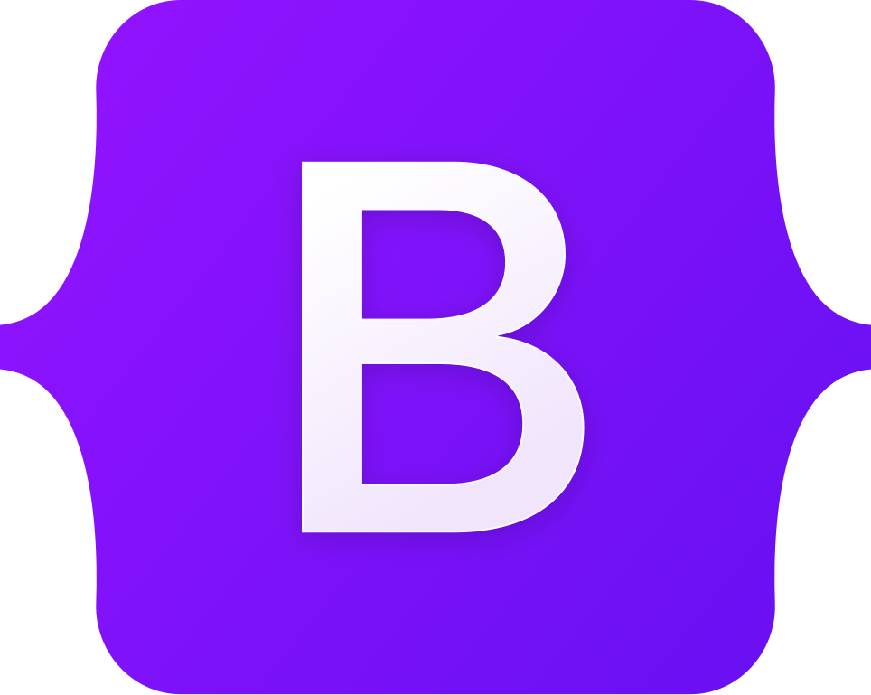

<h1 align="center" style="font-size: 70px;">Front-End Development</h1>


<h1 align="center">HTML – HyperText Markup Language</h1>

## **Module 1. HTML Basics (Absolute Zero)**
### 📚 Mavzular:
1. **What is HTML & how the web works**
2. **HTML document structure**
   - `<!DOCTYPE html>`
   - `<html>`, `<head>`, `<body>`
3. **HTML file naming & folder structure**
4. **Comments in HTML**
5. **VS Code + basic extensions** (Live Server)

### 🎯 **Natija:** O'quvchi mustaqil HTML sahifa ochadi

---

## **Module 2. Text & Content Elements**
### 📚 Mavzular:
6. **Headings (h1–h6)** — SEO basics
7. **Paragraphs & line breaks**
8. **Inline text elements**
   - `strong`, `em`, `mark`, `small`, `code`, `span`
9. **Lists**
   - Ordered / Unordered / Description lists
10. **HTML entities** (`&nbsp;`, `&lt;`, etc.)

### 🎯 **Natija:** To'g'ri matn struktura

---

## **Module 3. Links, Media & Assets**
### 📚 Mavzular:
11. **Anchor tag (`<a>`)**
    - Relative vs absolute paths
    - `target`, `download` atributlari
12. **Images (``)**
    - `src`, `alt` (accessibility)
13. **Audio & video**
14. **Favicon**
15. **File & asset organization**

### 🎯 **Natija:** Media bilan ishlay oladi

---

## **Module 4. Tables & Data Representation**
### 📚 Mavzular:
16. **Table structure**
    - `table`, `thead`, `tbody`, `tr`, `th`, `td`
17. **Table accessibility basics**
18. **Simple data layouts**

### 🎯 **Natija:** Ma'lumotli sahifalar

---

## **Module 5. Forms (VERY IMPORTANT)**
### 📚 Mavzular:
19. **Form structure**
20. **Input types**
    - `text`, `email`, `password`, `number`, `date`, `file`
21. **Radio, checkbox, select, textarea**
22. **Labels & accessibility**
23. **HTML validation**
    - `required`, `pattern`, `minlength`
24. **Form submission basics**

### 🎯 **Natija:** JS va backend'ga tayyor form

---

## **Module 6. Semantic HTML (PRO LEVEL)**
### 📚 Mavzular:
25. **Why semantic HTML matters**
26. **Semantic tags**
    - `header`, `nav`, `main`, `section`
    - `article`, `aside`, `footer`
27. **Proper page layout with semantics**
28. **SEO & screen readers basics**

### 🎯 **Natija:** Professional, real-world markup

---

## **Module 7. HTML + CSS Integration**
### 📚 Mavzular:
29. **Class & id usage strategy**
30. **Naming conventions** (BEM readiness)
31. **Linking CSS files**
32. **HTML structure for Flex/Grid**

### 🎯 **Natija:** CSS'ga mukammal tayyorlik

---

## **Module 8. Accessibility (A11y – 2026 MUST)**
### 📚 Mavzular:
33. **Alt text & labels**
34. **ARIA basics** (concept level)
35. **Keyboard navigation**
36. **Common accessibility mistakes**

### 🎯 **Natija:** Zamonaviy va mas'uliyatli frontend

---

## **Module 9. Performance & Best Practices**
### 📚 Mavzular:
37. **Clean HTML structure**
38. **Avoiding div soup**
39. **Image optimization basics**
40. **HTML linting mindset**

### 🎯 **Natija:** Professional HTML yozish odati

---

## **Module 10. HTML for JavaScript & React**
### 📚 Mavzular:
41. **Data attributes** (`data-*`)
42. **HTML structure for JS DOM**
43. **HTML mindset for React components**
44. **What HTML you DON'T write in React**

### 🎯 **Natija:** JS & React'ga erkin o'tish

---


<h1 align="center">CSS – Cascading Style Sheets</h1>

## **Module 1. CSS Fundamentals (HTML bilan parallel)**
### 📚 Mavzular:
1. **What is CSS & how it works**
2. **CSS syntax & rules**
3. **Ways to add CSS**
   - Inline styles
   - Internal/Embedded styles
   - External stylesheets
4. **CSS cascade, inheritance & specificity** (asosiy tushuncha)
5. **CSS reset vs normalize**

### 🎯 **Natija:** HTML elementlarini mustaqil style qila olish

---

## **Module 2. Selectors & Core Styling**
### 📚 Mavzular:
6. **Basic selectors**
   - Type selectors
   - Class selectors
   - ID selectors
   - Grouping selectors
7. **Combinators**
   - Descendant (` `)
   - Child (`>`)
   - Adjacent sibling (`+`)
   - General sibling (`~`)
8. **Attribute selectors**
9. **Modern selectors**
   - `:not()`
   - `:is()`
   - `:where()`

### 🎯 **Natija:** To'g'ri va professional selector yozish

---

## **Module 3. Text, Colors & Backgrounds**
### 📚 Mavzular:
10. **Color systems**
    - HEX, RGB, RGBA
    - HSL, HSLA
    - Modern colors (oklch - concept level)
11. **Text styling**
    - Alignment, transform, decoration
    - Spacing, line-height
    - Text shadows
12. **Backgrounds**
    - Background images
    - Gradients (linear, radial)

### 🎯 **Natija:** O'qiladigan va chiroyli UI

---

## **Module 4. Box Model & Sizing**
### 📚 Mavzular:
13. **Box model**
    - Content
    - Padding
    - Border
    - Margin
14. **Margin & padding** (shorthand notation)
15. **Width, height, min/max** properties
16. **`box-sizing: border-box`** (essential!)
17. **Overflow** (hidden, scroll, auto)

### 🎯 **Natija:** Layout buzilmasdan ishlashi

---

## **Module 5. Borders, Shadows & Effects**
### 📚 Mavzular:
18. **Border styles & radius**
19. **Box-shadow & text-shadow**
20. **Hover states** (`:hover` pseudo-class)
21. **Basic transitions** (hover effects)

### 🎯 **Natija:** Interaktiv elementlar

---

## **Module 6. Typography (Professional Level)**
### 📚 Mavzular:
22. **Font-family & font stacks**
23. **Google Fonts** integration
24. **Units**
    - Absolute: px
    - Relative: em, rem, %
    - Viewport: vw, vh
25. **Responsive typography**
26. **Accessibility basics** (font & contrast)

### 🎯 **Natija:** Professional dizayn hissi

---

## **Module 7. Layout Systems (ENG MUHIM QISM)**
### 📚 Mavzular:
27. **Display types**
    - block, inline, inline-block
    - none, flex, grid
28. **Positioning**
    - static, relative
    - absolute, fixed
    - sticky
29. **Flexbox (FULL MODULE)**
    - Flex container properties
    - Flex item properties
    - Axes, alignment, justification
    - Real-world layouts
30. **CSS Grid**
    - Grid container properties
    - Grid columns, rows, gaps
    - Grid template areas
    - Responsive grids

### 🎯 **Natija:** Har qanday layoutni qila olish

---

## **Module 8. Forms, Lists & Tables**
### 📚 Mavzular:
31. **Lists styling** (custom bullets, markers)
32. **Tables & `:nth-child()`**
33. **Forms styling** (inputs, buttons, labels)
34. **Form states** (focus, checked, disabled)

### 🎯 **Natija:** Real web sahifa elementlari

---

## **Module 9. Pseudo-Classes & Elements**
### 📚 Mavzular:
35. **State pseudo-classes**
    - `:hover`, `:focus`, `:active`
    - `:visited`, `:checked`
36. **Structural pseudo-classes**
    - `:first-child`, `:last-child`
    - `:nth-child()`
37. **Pseudo-elements**
    - `::before`, `::after`
    - `::first-letter`, `::first-line`

### 🎯 **Natija:** Murakkab UI effektlar

---

## **Module 10. Responsive Design**
### 📚 Mavzular:
38. **Media queries** (breakpoints)
39. **Mobile-first approach**
40. **Responsive layouts** (flexible grids)
41. **Responsive images** (`srcset`, `picture`)

### 🎯 **Natija:** Telefon, planshet, desktop

---

## **Module 11. Transforms, Transitions & Animations**
### 📚 Mavzular:
42. **Transforms (2D)**
    - translate, rotate, scale, skew
43. **Transitions & timing functions**
44. **CSS animations**
    - `@keyframes`
    - Animation properties
45. **Micro-interactions** (button effects, loading animations)

### 🎯 **Natija:** Zamonaviy UI harakati

---

## **Module 12. Modern CSS (React & SASS Ready)**
### 📚 Mavzular:
46. **CSS Variables** (`:root`, `var()`)
47. **Theme switching** (dark/light mode)
48. **Component-based CSS mindset**
49. **BEM naming convention**
50. **CSS for React components** (CSS Modules, styled-components)

### 🎯 **Natija:** React va SASS'ga tayyorlik

---

## **Module 13. Performance & Best Practices**
### 📚 Mavzular:
51. **Clean CSS structure** (organization patterns)
52. **Avoiding layout shift** (CLS optimization)
53. **Maintainable CSS** (scalability)
54. **Common mistakes** to avoid

---


<h1 align="center">SASS – Syntactically Awesome Stylesheets</h1>

## **Module 1. Introduction to SASS**
### 📚 Mavzular:
1. **What is SASS & why we use it**
2. **SASS vs CSS** (advantages and features)
3. **How to install & setup SASS**
   - npm installation
   - CLI setup
   - VS Code extensions (Live SASS Compiler)
4. **SASS file structure** (`.scss` vs `.sass` syntax)
5. **Compiling SASS to CSS**
   - Watch mode
   - Auto-compile
   - Production builds

### 🎯 **Natija:** O'quvchi SASSni ishga tushira oladi

---

## **Module 2. Variables & Constants**
### 📚 Mavzular:
6. **SASS variables**
   ```scss
   $primary-color: #3498db;
   $font-stack: 'Roboto', sans-serif;
   $spacing-unit: 16px;
   ```
7. **Using variables for**
   - Colors, fonts, spacing
   - Breakpoints, z-indexes
8. **Global variables & :root integration**
   ```scss
   :root {
     --primary-color: #{$primary-color};
   }
   ```
9. **Nested variables & maps**
   ```scss
   $colors: (
     "primary": #3498db,
     "secondary": #2ecc71,
     "danger": #e74c3c
   );
   ```

### 🎯 **Natija:** Kodni reusable va maintainable qilish

---

## **Module 3. Nesting & Partials**
### 📚 Mavzular:
10. **Nesting selectors**
    ```scss
    .navbar {
      background: $primary-color;
      
      .nav-item {
        padding: 10px;
        
        &:hover {
          background: darken($primary-color, 10%);
        }
      }
    }
    ```
11. **Avoiding over-nesting** (max 3 levels)
12. **Partials** (`_header.scss`, `_buttons.scss`, `_variables.scss`)
13. **Modern import system**
    ```scss
    // Old (deprecated)
    @import 'variables';
    
    // New (recommended)
    @use 'variables' as *;
    @forward 'buttons';
    ```

### 🎯 **Natija:** Tizimli va modul CSS

---

## **Module 4. Mixins & Functions**
### 📚 Mavzular:
14. **Mixins for reusable code**
    ```scss
    @mixin button($color, $size: 'medium') {
      background: $color;
      border: none;
      border-radius: 4px;
      padding: map-get($button-sizes, $size);
      cursor: pointer;
      
      &:hover {
        background: darken($color, 10%);
      }
    }
    ```
15. **Using @include**
    ```scss
    .btn-primary {
      @include button($primary-color, 'large');
    }
    ```
16. **Built-in functions**
    ```scss
    lighten($color, 20%)
    darken($color, 15%)
    rgba($color, 0.5)
    percentage(1/4)
    ```
17. **Conditional statements**
    ```scss
    @mixin theme($mode: 'light') {
      @if $mode == 'light' {
        background: white;
        color: black;
      } @else {
        background: black;
        color: white;
      }
    }
    ```

### 🎯 **Natija:** Professional UI components yaratish

---

## **Module 5. Loops & Control Directives**
### 📚 Mavzular:
18. **Loops**
    ```scss
    // @for loop
    @for $i from 1 through 12 {
      .col-#{$i} {
        width: percentage($i/12);
      }
    }
    
    // @each loop
    @each $key, $color in $colors {
      .text-#{$key} {
        color: $color;
      }
    }
    ```
19. **Generating classes dynamically**
20. **Using loops for**
    - Grid systems
    - Spacing utilities
    - Responsive classes

### 🎯 **Natija:** Code repetition kamayadi, scalable CSS

---

## **Module 6. Extend / Inheritance**
### 📚 Mavzular:
21. **@extend directive**
    ```scss
    .button-base {
      padding: 10px 20px;
      border-radius: 4px;
    }
    
    .btn-primary {
      @extend .button-base;
      background: $primary-color;
    }
    ```
22. **Placeholder selectors**
    ```scss
    %button-base {
      padding: 10px 20px;
      border-radius: 4px;
    }
    
    .btn-primary {
      @extend %button-base;
      background: $primary-color;
    }
    ```
23. **Combining with mixins**

### 🎯 **Natija:** DRY (Don't Repeat Yourself) prinsipiga mos

---

## **Module 7. Modular & Component-Based SASS**
### 📚 Mavzular:
24. **Structure for big projects**
    ```
    src/scss/
    ├── abstracts/
    │   ├── _variables.scss
    │   ├── _mixins.scss
    │   └── _functions.scss
    ├── base/
    │   ├── _reset.scss
    │   └── _typography.scss
    ├── components/
    │   ├── _buttons.scss
    │   ├── _cards.scss
    │   └── _navbar.scss
    ├── layout/
    │   ├── _header.scss
    │   └── _footer.scss
    └── main.scss
    ```
25. **Component-based architecture**
26. **Themes & color palettes**
27. **Dark/Light mode switch**
    ```scss
    [data-theme="dark"] {
      @include dark-theme;
    }
    ```

### 🎯 **Natija:** React va modern frontend tayyorlik

---

## **Module 8. SASS + CSS Animations**
### 📚 Mavzular:
28. **Using SASS variables in keyframes**
    ```scss
    $animation-duration: 0.3s;
    
    @keyframes slide-in {
      from {
        transform: translateX(-100%);
      }
      to {
        transform: translateX(0);
      }
    }
    
    .element {
      animation: slide-in $animation-duration ease;
    }
    ```
29. **Parametric animations via mixins**
    ```scss
    @mixin fade-in($duration: 0.5s) {
      animation: fade-in $duration ease;
    }
    ```
30. **Reusable transitions & hover effects**

### 🎯 **Natija:** Professional, maintainable animations

---


<h1 align="center">Bootstrap</h1>

## **Module 1. Introduction & Setup**
### 📚 Mavzular:
1. **What is Bootstrap & why we use it**
2. **Version 5/6 differences** (Bootstrap 5 is current)
3. **Including Bootstrap**
   - CDN method
   - npm installation
4. **Basic folder & project setup**
5. **Integrating with SASS** (custom builds)

### 🎯 **Natija:** Bootstrapni ishga tushira oladi

---

## **Module 2. Grid System (Core of Bootstrap)**
### 📚 Mavzular:
6. **Containers**
   - `.container` (responsive fixed-width)
   - `.container-fluid` (full width)
7. **Rows & Columns**
   ```html
   <div class="container">
     <div class="row">
       <div class="col-md-6 col-sm-12">
         <!-- Content -->
       </div>
     </div>
   </div>
   ```
8. **Auto-layout & flex utilities**
   ```html
   <div class="row">
     <div class="col">Auto width</div>
     <div class="col-6">Fixed width</div>
   </div>
   ```
9. **Responsive design**
   - Breakpoints: xs, sm, md, lg, xl, xxl
   - Responsive utilities

### 🎯 **Natija:** Har qanday layout yaratish

---

## **Module 3. Typography & Utilities**
### 📚 Mavzular:
11. **Text utilities**
    - `.text-center`, `.text-primary`
    - `.fs-1` to `.fs-6` (font sizes)
12. **Background utilities**
    - `.bg-primary`, `.bg-light`
13. **Spacing utilities**
    - Margin: `m-1` to `m-5`, `mx-auto`
    - Padding: `p-1` to `p-5`
14. **Display utilities**
    - `.d-flex`, `.d-grid`, `.d-none`
    - Responsive: `.d-md-block`
15. **Flex utilities**
    - `.justify-content-center`
    - `.align-items-start`

### 🎯 **Natija:** Tez va toza styling

---

## **Module 4. Components**
### 📚 Mavzular:
16. **Buttons & badges**
    ```html
    <button class="btn btn-primary">
      Primary Button
      <span class="badge bg-secondary">4</span>
    </button>
    ```
17. **Cards & card groups**
    ```html
    <div class="card" style="width: 18rem;">
      
      <div class="card-body">
        <h5 class="card-title">Card title</h5>
        <p class="card-text">Card content</p>
      </div>
    </div>
    ```
18. **Navbar & dropdowns**
19. **Forms & input groups**
20. **Modals & popovers**

### 🎯 **Natija:** Real-world UI elementlari

---

## **Module 5. Bootstrap JS Plugins**
### 📚 Mavzular:
21. **Collapse / Accordion**
    ```html
    <div class="accordion" id="accordionExample">
      <div class="accordion-item">
        <h2 class="accordion-header">
          <button class="accordion-button" type="button" 
                  data-bs-toggle="collapse" 
                  data-bs-target="#collapseOne">
            Accordion Item #1
          </button>
        </h2>
      </div>
    </div>
    ```
22. **Carousel**
23. **Modal behavior**
24. **Tooltips & Popovers**
25. **Integration with Vanilla JS**

### 🎯 **Natija:** Interactive UI tayyorlash

---

## **Module 6. Advanced Bootstrap & Best Practices**
### 📚 Mavzular:
26. **Customizing Bootstrap via SASS**
    ```scss
    // Custom variables
    $primary: #ff6b6b;
    $font-family-base: 'Inter', sans-serif;
    
    // Import Bootstrap
    @import "bootstrap/scss/bootstrap";
    ```
27. **Creating themes**
    ```scss
    .custom-theme {
      --bs-primary: #ff6b6b;
      --bs-body-font-family: 'Inter', sans-serif;
    }
    ```
28. **Utility-first mindset**
29. **Responsive & accessible components**
30. **Avoiding CSS conflicts**
    ```css
    /* Specificity */
    .btn.btn-custom {
      /* Your custom styles */
    }
    ```

### 🎯 **Natija:** Professional, maintainable Bootstrap projects

---


<h1 align="center">JavaScript - Programming Language</h1>

## **Course Structure Overview**
- **Duration:** 12–16 weeks (adjustable)
- **Flow:** Beginner → Intermediate → Advanced → Projects / Exam
- **Each module:** Theory + Live Examples + Exercises + Mini-project

---

## **Module 0 — Setup & Tools**
### 📚 Mavzular:
- **Editor & extensions** (VS Code, Live Server, Prettier, ESLint)
- **Browser devtools** (Console, Sources, Network, Performance)
- **Node.js & npm basics** (node, npm init, npx)
- **Using CDN vs local scripts**

### 🎯 **Natija:** O'quvchi ishlab chiqish muhitini sozlaydi, konsol va paket menejerlarini ishlata oladi.

---

## **Module 1 — JavaScript Fundamentals**
### 📚 Mavzular:
- **What is JS;** environments: Browser vs Node.js
- **console methods** (log, warn, error, table)
- **Variables:** let, const, var; scope (global, block, function)
- **Data types:** Number, String, Boolean, Null, Undefined, Symbol, BigInt
- **Operators:** arithmetic, assignment, comparison, logical, ternary, typeof
- **Type conversion & coercion**

### 🎯 **Natija:** O'quvchi JS asoslarini, o'zgaruvchilar va turlarni tushunadi hamda konsolda diagnostika qiladi.

---

## **Module 2 — Numbers & Math**
### 📚 Mavzular:
- **Number methods:** parseInt, parseFloat, Number.isNaN, Number.isFinite
- **Formatting:** toFixed, toPrecision
- **Math object:** Math.sqrt, floor, ceil, round, trunc, pow, abs, min, max, random, sign
- **Handling floats & precision issues**

### 🎯 **Natija:** Raqamlar bilan ishonchli ishlaydi va Math utilitilarini qo'llaydi.

---

## **Module 3 — Strings & Regular Expressions**
### 📚 Mavzular:
- **String core:** length, indexing, charAt, charCodeAt
- **Manipulation:** slice, substring, substr, replace, replaceAll, split, join
- **Search & checks:** indexOf, includes, startsWith, endsWith, search, match
- **Case & trim:** toUpperCase, toLowerCase, trim, trimStart, trimEnd, repeat, padStart, padEnd
- **Template literals,** interpolation, multi-line strings
- **Regular Expressions:** syntax, flags, test, exec, common patterns (email, phone, validation)

### 🎯 **Natija:** O'quvchi matnni manipulyatsiya qiladi va regex bilan validatsiya qilishi mumkin.

---

## **Module 4 — Dates & Time**
### 📚 Mavzular:
- **Date constructor,** parsing dates, timestamps
- **Get methods:** getFullYear, getMonth, getDate, getDay, getHours, getMinutes, getSeconds
- **Formatting dates,** timezones basics, libraries mention (dayjs / date-fns)

### 🎯 **Natija:** Vaqt va sana bilan ishlaydi, vaqtni formatlash va pars qilishni biladi.

---

## **Module 5 — Arrays (Complete)**
### 📚 Mavzular:
- **Array creation,** indexing, length property
- **Mutating methods:** push, pop, shift, unshift, splice, sort, reverse
- **Non-mutating methods:** slice, concat, join
- **Iteration:** for, for...of, forEach
- **Functional methods:** map, filter, reduce, find, findIndex, some, every
- **Modern helpers:** flat, flatMap, at, copyWithin, fill
- **Spread operator,** destructuring arrays, Array.from, Array.isArray

### 🎯 **Natija:** Murakkab array operatsiyalarini va ES6 array patternlarini ishlata oladi.

---

## **Module 6 — Functions & Scope**
### 📚 Mavzular:
- **Function declaration** vs expression vs arrow functions
- **Parameters,** rest ...args, default parameters
- **Return values,** immediately-invoked function expressions (IIFE)
- **Closures,** lexical scope, hoisting
- **`this`** in functions and arrow functions
- **Higher-order functions,** currying, function composition

### 🎯 **Natija:** Funktsiyalarni professional darajada yozadi, closure va scope'ni tushunadi.

---

## **Module 7 — Objects & Object Patterns**
### 📚 Mavzular:
- **Object literals,** property access (obj.prop, obj['prop'])
- **Shorthand properties,** computed property names
- **Methods,** `this`, method binding (bind, call, apply)
- **Object utilities:** Object.keys, values, entries, assign, freeze, seal
- **Deep vs shallow copy** (structuredClone / JSON / spread)

### 🎯 **Natija:** Obyekt bilan ishlash, kontekstni boshqarish va obyekt utilitilaridan foydalanishni biladi.

---

## **Module 8 — Classes & OOP**
### 📚 Mavzular:
- **ES6 class syntax,** constructor, prototype, methods
- **Inheritance** (extends, super)
- **Encapsulation patterns** (private fields #, closures)
- **Mixins & composition** vs classical inheritance

### 🎯 **Natija:** Sinflar va OOP printsiplarini qo'llaydi, konstruktor va merosxo'rlikni tushunadi.

---

## **Module 9 — Modules & Tooling**
### 📚 Mavzular:
- **ES Modules:** export / import (named vs default)
- **Dynamic imports** (`import()`) and code-splitting concepts
- **npm packages,** semantic versioning, package.json scripts
- **Bundlers & dev servers** overview: Vite / Webpack / Parcel (concept level)
- **Linters & formatters:** ESLint, Prettier; configuring scripts

### 🎯 **Natija:** Katta loyihalarda modul tizimi va tooling'ni boshqaradi.

---

## **Module 10 — Asynchronous JavaScript**
### 📚 Mavzular:
- **Callbacks** and callback hell (problems)
- **Promises:** constructor, then, catch, finally
- **async / await** pattern, error handling with try/catch
- **Promise utilities:** Promise.all, race, allSettled, any

### 🎯 **Natija:** Asinxron kodni toza va nazorat qilinadigan usulda yozadi.

---

## **Module 11 — HTTP & Fetch / Axios**
### 📚 Mavzular:
- **HTTP basics:** methods (GET, POST, PUT, DELETE), status codes, headers, JSON body
- **Fetch API:** fetch, response parsing (`.json()`), error handling
- **Axios:** usage and advantages, interceptors
- **Handling CORS** basics and common issues

### 🎯 **Natija:** API bilan muloqot qiladi va ma'lumotlarni yuklab/saqlaydi.

---

## **Module 12 — Browser APIs & BOM**
### 📚 Mavzular:
- **DOM vs BOM** overview
- **Window,** location, history, navigator, screen APIs
- **Clipboard API,** Geolocation, Fullscreen API, Visibility API, Web Storage events
- **Intro to Canvas 2D** (basic drawing) and Web Audio (concepts)

### 🎯 **Natija:** Brauzerning kengroq API'larini ishlatadi va interaktiv funksiyalar yarata oladi.

---

## **Module 13 — DOM Manipulation & Events (Deep)**
### 📚 Mavzular:
- **Selecting elements:** querySelector, querySelectorAll, live vs static lists
- **Creating, inserting, cloning, removing nodes** (createElement, append, insertBefore, replaceChild)
- **innerHTML vs textContent** vs safe DOM updates
- **Event handling:** addEventListener, passive listeners, event delegation, capturing vs bubbling
- **Event object:** preventDefault, stopPropagation, target, currentTarget

### 🎯 **Natija:** DOM va events bilan samarali va xavfsiz ishlaydi.

---

## **Module 14 — Forms, Validation & Accessibility**
### 📚 Mavzular:
- **Form elements,** input attributes, validation APIs (checkValidity, setCustomValidity)
- **Regex validation,** constraint validation, progressive enhancement
- **ARIA basics:** roles, aria-label, aria-hidden; keyboard accessibility tips
- **Accessible error messages** and focus management

### 🎯 **Natija:** Formalarni to'liq validatsiyalash va kirish uchun qulay qilishni biladi.

---

## **Module 15 — Storage & State Management**
### 📚 Mavzular:
- **localStorage, sessionStorage, cookies** — use-cases & limitations
- **Serialization** (JSON.stringify / JSON.parse)
- **Simple client-side state patterns** (pub/sub, module-scoped state)
- **Introduction to IndexedDB** / local DB concepts (overview)

### 🎯 **Natija:** Brauzerda ma'lumot saqlash va oddiy state boshqaruvini amalga oshiradi.

---

## **Module 16 — Error Handling, Debugging & Testing**
### 📚 Mavzular:
- **Error types,** try/catch/finally, throwing errors, custom Error classes
- **Debugging** with breakpoints, stepping, watch expressions, performance profiling
- **Unit testing basics** with Jest / Vitest: writing tests, mocks, assertions
- **Basic E2E testing** mention (Playwright / Cypress)

### 🎯 **Natija:** Xatolarni topadi, test yozadi va kod sifatini oshiradi.

---

## **Module 17 — Performance & Security**
### 📚 Mavzular:
- **Performance:** reflow/repaint, minimizing layout thrash, lazy-loading, debouncing, throttling
- **Resource optimization:** image optimization, code-splitting, caching strategies
- **Security basics:** XSS, CSRF concepts, sanitization, Content Security Policy (CSP) overview

### 🎯 **Natija:** Sahifa tezligini oshiradi va asosiy xavfsizlik tahdidlaridan himoyalaydi.

---

## **Module 18 — Modern Patterns & Advanced Topics**
### 📚 Mavzular:
- **Functional programming patterns** in JS (pure functions, immutability)
- **Reactive programming intro** (observables concept)
- **State immutability,** structural sharing, shallow vs deep equality
- **Introduction to TypeScript** (why, basic types, migration path) — optional but recommended
- **Web Components basics** (Custom Elements, Shadow DOM) — overview

### 🎯 **Natija:** Zamonaviy kod yozish uslublarini tushunadi va TypeScriptga o'tishga tayyor bo'ladi.

---

## **Module 19 — Tooling, Workflow & Deployment**
### 📚 Mavzular:
- **Build & deploy basics** (Netlify, Vercel, static hosting)
- **CI basics** (GitHub Actions example)
- **Versioning & release process** (semantic versioning)

### 🎯 **Natija:** Loyihani ishlab chiqishdan production'ga chiqarishgacha bosqichlarni biladi.

---

## **Module 20 — Final Projects & Assessment**
### 🏆 **Final Projects:**
1. **Project A:** Interactive CRUD app (forms, localStorage, validation, modular code)
2. **Project B:** API-driven app (fetch/axios, pagination, caching)
3. **Project C:** Mini game (Tic-Tac-Toe or Memory) with score/save feature
4. **Final exam:** build a small full-featured SPA (HTML/CSS/JS) or present React migration plan

### 🎯 **Natija:** O'quvchi mustaqil real-world loyihani boshlang'ichdan production-ready holatga keltiradi.

---


<h1 align="center">Git and GitHub</h1>

## **Module 0 — Setup & Tooling**
### 📚 Mavzular:
- **Install Git** (Windows / macOS / Linux)
- **Configure user**: `git config --global user.name` & `user.email`
- **SSH keys vs HTTPS**: Generating SSH keys and adding to GitHub
- **Git GUI clients**: SourceTree, GitKraken, GitHub Desktop
- **IDE integrations**: VS Code Git features
- **GitHub account setup**: Two-factor authentication (2FA), Personal Access Tokens (PATs)

### 🎯 **Natija:** O'quvchi Git va GitHub muhitini xavfsiz va to'g'ri sozlaydi.

---

## **Module 1 — Git Basics**
### 📚 Mavzular:
- **What is VCS**: Git vs centralized VCS (SVN) concepts
- **Repository lifecycle**: 
  ```bash
  git init
  git clone <url>
  ```
- **.gitignore** file patterns
- **Staging area**:
  ```bash
  git add <file>
  git status
  git diff
  ```
- **Commits**:
  ```bash
  git commit -m "message"
  git commit --amend
  ```
- **Reading history**:
  ```bash
  git log
  git show
  git blame
  ```

### 🎯 **Natija:** O'quvchi lokal repozitoriya yaratadi, fayllarni kuzatadi va commitlarni boshqaradi.

---

## **Module 2 — Branching & Merging (Core)**
### 📚 Mavzular:
- **Branch concept**:
  ```bash
  git branch
  git checkout <branch>
  git switch <branch>
  ```
- **Branch naming conventions**:
  - `feature/login-system`
  - `bugfix/header-issue`
  - `hotfix/production-bug`
- **Merging**:
  ```bash
  git merge <branch>
  ```
  - Fast-forward vs 3-way merge
- **Conflict resolution**:
  - Conflict markers resolution
  - Testing after merge
- **Branching models**:
  - Git Flow
  - GitHub Flow
  - Trunk-based development

### 🎯 **Natija:** O'quvchi mustaqil branchlarda ishlaydi va xavfsiz birlashtiradi.

---

## **Module 3 — Remote Repositories (GitHub)**
### 📚 Mavzular:
- **Remotes**:
  ```bash
  git remote add origin <url>
  git remote -v
  git fetch
  git pull
  git push origin main
  ```
- **Forks vs clones**: Upstream remote workflow
- **Tracking branches**:
  ```bash
  git branch -u origin/main
  ```
- **Git pull strategies**:
  ```bash
  git pull --rebase
  git pull --merge
  ```
- **Working with GitHub**:
  - Creating repositories
  - README.md best practices
  - LICENSE files
  - .gitignore templates

### 🎯 **Natija:** O'quvchi GitHub bilan ishlaydi, remote push/pull va fork workflow'ni biladi.

---

## **Module 4 — Rewriting History (Carefully)**
### 📚 Mavzular:
- **Rebasing**:
  ```bash
  git rebase -i HEAD~3
  ```
  - Squash commits
  - Reorder commits
  - Edit commit messages
- **Reset types**:
  ```bash
  git reset --soft HEAD~1
  git reset --mixed HEAD~1
  git reset --hard HEAD~1
  ```
- **Revert vs Reset**:
  ```bash
  git revert <commit-hash>    # Safe for shared history
  git reset <commit-hash>     # Local history only
  ```
- **Cherry-pick**:
  ```bash
  git cherry-pick <commit-hash>
  ```

### 🎯 **Natija:** O'quvchi commit tarixini tozalaydi va xatoliklarni xavfsiz tuzatadi.

---

## **Module 5 — Stashing, Tags & Releases**
### 📚 Mavzular:
- **Stashing**:
  ```bash
  git stash
  git stash list
  git stash apply
  git stash pop
  git stash branch <name>
  ```
- **Tags**:
  ```bash
  git tag v1.0.0                    # Lightweight tag
  git tag -a v1.0.0 -m "Release"   # Annotated tag
  git tag --sign v1.0.0            # Signed tag (GPG)
  ```
- **Semantic Versioning** (semver):
  - `MAJOR.MINOR.PATCH`
  - `1.2.3`
- **GitHub Releases**:
  - Creating releases
  - Release notes
  - Asset attachments

### 🎯 **Natija:** O'quvchi vaqtinchalik o'zgarishlarni saqlaydi va versiyalashni boshqaradi.

---

## **Module 6 — Recovery & Diagnostics**
### 📚 Mavzular:
- **Reflog** (recovery tool):
  ```bash
  git reflog
  git reset --hard HEAD@{1}
  ```
- **Finding regressions**:
  ```bash
  git bisect start
  git bisect bad
  git bisect good <commit>
  git bisect reset
  ```
- **Cleaning workspace**:
  ```bash
  git clean -n    # Dry run
  git clean -f    # Force remove untracked
  ```
- **Maintenance**:
  ```bash
  git gc          # Garbage collection
  git prune       # Remove unreachable objects
  ```

### 🎯 **Natija:** O'quvchi muammolarni aniqlaydi va yo'qolgan ishlarni tiklaydi.

---

## **Module 7 — Git Internals (Conceptual)**
### 📚 Mavzular:
- **Git Objects Model**:
  - Blobs (file contents)
  - Trees (directories)
  - Commits (metadata)
  - Refs (branches/tags)
- **HEAD pointer**: Current branch reference
- **Index structure**: Staging area
- **Packfiles**: Compression mechanism
- **Why Git is fast**: Content-addressable storage

### 🎯 **Natija:** O'quvchi Git qanday ishlashini ichidan tushunadi va murakkab holatlarni yengillashtiradi.

---

## **Module 8 — Collaboration on GitHub (PR Workflow)**
### 📚 Mavzular:
- **Pull Request workflow**:
  1. Fork repository
  2. Create feature branch
  3. Make changes and commit
  4. Push to fork
  5. Create PR
  6. Review process
  7. Merge strategies:
     ```bash
     # Merge commit
     git merge --no-ff feature
     
     # Squash merge
     git merge --squash feature
     
     # Rebase merge
     git rebase main
     ```
- **Code review best practices**:
  - Meaningful comments
  - Request changes
  - Approve with suggestions
- **Draft PRs**: Work in progress
- **PR templates**: Standardized descriptions
- **Protected branches**: Require reviews, status checks

### 🎯 **Natija:** O'quvchi jamoa bilan professional PR asosida hamkorlik qiladi.

---

## **Module 9 — GitHub Features & Modern Workflows**
### 📚 Mavzular:
- **Issues & Projects**:
  - Labels, milestones, assignees
  - Project boards (Kanban)
  - Task lists in issues
- **GitHub Actions basics**:
  ```yaml
  name: CI Pipeline
  on: [push]
  jobs:
    test:
      runs-on: ubuntu-latest
      steps:
        - uses: actions/checkout@v3
        - run: npm install
        - run: npm test
  ```
- **Dependabot**: Dependency updates
- **Security alerts**: Vulnerability scanning
- **GitHub Pages**: Static site hosting
  ```yaml
  # .github/workflows/deploy.yml
  - name: Deploy
    uses: peaceiris/actions-gh-pages@v3
    with:
      github_token: ${{ secrets.GITHUB_TOKEN }}
      publish_dir: ./dist
  ```

### 🎯 **Natija:** O'quvchi GitHub imkoniyatlaridan foydalangan holda loyiha avtomatlashtiradi va boshqaradi.

---

## **Module 10 — Security & Signing**
### 📚 Mavzular:
- **Authentication methods**:
  - SSH keys (recommended)
  - HTTPS with PATs
- **Commit signing**:
  ```bash
  # GPG signing
  git config commit.gpgsign true
  
  # SSH signing (Git 2.34+)
  git config gpg.format ssh
  ```
- **GitHub Secrets**: Encrypted environment variables
- **Security configurations**:
  - CODEOWNERS file
  - Branch protection rules
  - Required status checks
  - 2FA enforcement
- **Organization security**:
  - Team permissions
  - Repository access levels

### 🎯 **Natija:** O'quvchi xavfsiz repozitoriya amaliyotlarini joriy etadi.

---

## **Module 11 — Monorepos, Submodules & LFS**
### 📚 Mavzular:
- **Monorepos**:
  - Pros and cons
  - Tooling: pnpm workspaces, Nx, Lerna
  ```json
  // package.json (workspace)
  {
    "workspaces": ["packages/*"]
  }
  ```
- **Git submodules**:
  ```bash
  git submodule add <url> <path>
  git submodule update --init --recursive
  ```
  - Pitfalls and solutions
- **Git LFS** (Large File Storage):
  ```bash
  git lfs install
  git lfs track "*.psd"
  git add .gitattributes
  ```
  - Use cases: images, videos, binaries
  - Storage limitations

### 🎯 **Natija:** O'quvchi katta loyihalar va katta fayllar bilan ishlash strategiyasini biladi.

---

## **Module 12 — Advanced Strategies & Best Practices**
### 📚 Mavzular:
- **Commit message conventions**:
  ```
  feat: add user authentication
  fix: resolve header alignment issue
  chore: update dependencies
  docs: update README
  ```
  - Conventional Commits specification
  - Automatic changelog generation
- **Branch naming**:
  ```
  feature/user-profile
  bugfix/login-error
  hotfix/production-crash
  release/v1.2.0
  ```
- **Atomic commits**: One logical change per commit
- **Small PRs**: Focused, reviewable changes
- **Performance optimizations**:
  ```bash
  git clone --depth 1 <url>      # Shallow clone
  git sparse-checkout init       # Partial checkout
  git gc --aggressive           # Optimize repository
  ```

### 🎯 **Natija:** O'quvchi jamoaviy kod bazasini tartib bilan saqlaydi va samarali ishlaydi.

---

## **Module 13 — Automation & CI/CD with GitHub Actions (Practical)**
### 📚 Mavzular:
- **Complete CI/CD pipeline**:
  ```yaml
  name: CI/CD Pipeline
  on:
    push:
      branches: [main]
    pull_request:
      branches: [main]
  
  jobs:
    lint:
      runs-on: ubuntu-latest
      steps:
        - uses: actions/checkout@v3
        - uses: actions/setup-node@v3
        - run: npm ci
        - run: npm run lint
    
    test:
      needs: lint
      runs-on: ubuntu-latest
      steps:
        - uses: actions/checkout@v3
        - uses: actions/setup-node@v3
        - run: npm ci
        - run: npm test
    
    deploy:
      needs: test
      if: github.ref == 'refs/heads/main'
      runs-on: ubuntu-latest
      steps:
        - uses: actions/checkout@v3
        - run: npm run build
        - uses: peaceiris/actions-gh-pages@v3
          with:
            github_token: ${{ secrets.GITHUB_TOKEN }}
            publish_dir: ./dist
  ```
- **Matrix builds**: Multiple OS/Node versions
- **Caching dependencies**:
  ```yaml
  - uses: actions/cache@v3
    with:
      path: node_modules
      key: ${{ runner.os }}-node-${{ hashFiles('package-lock.json') }}
  ```
- **Release automation**:
  - Semantic version tagging
  - Automatic GitHub Releases
  - Changelog generation

### 🎯 **Natija:** O'quvchi CI/CD pipeline yozadi va loyihani avtomatik deploy qiladi.

---

## **Module 14 — Code Review, Governance & Teaming**
### 📚 Mavzular:
- **Effective code review checklist**:
  - ✅ Code quality
  - ✅ Security considerations
  - ✅ Test coverage
  - ✅ Documentation
  - ✅ Performance impact
- **CODEOWNERS file**:
  ```
  # .github/CODEOWNERS
  *.js @frontend-team
  /docs/ @docs-team
  /api/ @backend-team
  ```
- **Branch protection rules**:
  - Require PR approvals
  - Require status checks
  - Require linear history
- **GitHub Teams**:
  - Organization structure
  - Team permissions
  - Repository access
- **Documentation**:
  - CONTRIBUTING.md
  - PULL_REQUEST_TEMPLATE.md
  - ISSUE_TEMPLATE.md

### 🎯 **Natija:** O'quvchi code review jarayonini boshqaradi va jamoani tartibga soladi.

---

## **Module 15 — Real-World Projects & Assessments**
### 🏆 **Mini Projects:**

#### **Project 1: Personal Portfolio with CI/CD**
- Create portfolio website
- Set up GitHub Pages
- Implement CI/CD pipeline
- Automated deployment
```bash
# Expected structure
portfolio/
├── .github/workflows/deploy.yml
├── src/
├── package.json
└── README.md
```

#### **Project 2: Team Collaboration Workflow**
- Fork a repository
- Create feature branch
- Implement feature
- Create PR with reviews
- Address review comments
- Merge to main

#### **Project 3: Full CI/CD Pipeline**
- Test automation
- Build process
- Deployment to multiple environments
- Release automation
- Monitoring setup

#### **Final Exam: Complete Repository Lifecycle**
1. **Feature development** with proper branching
2. **PR creation** with template
3. **Code review** process simulation
4. **Conflict resolution** scenario
5. **Merge strategies** implementation
6. **Release creation** with semantic versioning
7. **Deployment** to staging/production
8. **Recovery scenario**: Broken merge fix

### 🎯 **Natija:** O'quvchi real jamoaviy repozitoriyada to'liq ishlaydi va muammolarni hal qiladi.

---


<h1 align="center">REACT - MODERN WEB DEVELOPMENT</h1>

## **Course Overview**
- **Recommended duration:** 12–20 weeks (beginner → advanced → projects)
- **Workflow:** Vite + npm/pnpm + ESLint + Prettier + GitHub Actions
- **Focus:** React 18+, Hooks, Performance, Accessibility, Testing, TypeScript readiness, Production workflows

---

## **Module 0 — Environment & First App**
### 📚 Mavzular:
- **Installing Node.js** & package managers (npm / pnpm / yarn)
- **Create a new app:**
  ```bash
  npm create vite@latest my-app -- --template react
  # or
  npx create-react-app my-app (legacy)
  ```
- **Project structure:**
  ```
  my-app/
  ├── src/
  │   ├── App.jsx
  │   ├── main.jsx
  │   └── index.css
  ├── public/
  ├── package.json
  └── vite.config.js
  ```
- **Package.json scripts:**
  ```json
  {
    "scripts": {
      "dev": "vite",
      "build": "vite build",
      "preview": "vite preview"
    }
  }
  ```
- **React 18 features:**
  ```jsx
  import { createRoot } from 'react-dom/client';
  import { StrictMode } from 'react';
  
  createRoot(document.getElementById('root')).render(
    <StrictMode>
      <App />
    </StrictMode>
  );
  ```

### 🎯 **Natija:** O'quvchi React dev muhitini sozlaydi, yangi app yaratadi va run/deploy jarayonini tushunadi.

---

## **Module 1 — JSX, Components & Props**
### 📚 Mavzular:
- **JSX syntax & rules:**
  ```jsx
  const element = <h1>Hello, {name}!</h1>;
  const condition = isLoggedIn && <Welcome />;
  const result = score > 60 ? <Passed /> : <Failed />;
  ```
- **Function components:**
  ```jsx
  // Arrow function
  const Button = ({ children, onClick }) => {
    return <button onClick={onClick}>{children}</button>;
  };
  
  // Regular function
  function Card({ title, content }) {
    return (
      <div className="card">
        <h2>{title}</h2>
        <p>{content}</p>
      </div>
    );
  }
  ```
- **Props & children:**
  ```jsx
  const UserProfile = ({ name, age = 25, children }) => {
    return (
      <div>
        <h2>{name} - {age} years</h2>
        {children}
      </div>
    );
  };
  ```
- **Component composition:**
  ```jsx
  const App = () => (
    <Layout>
      <Header />
      <Main>
        <Sidebar />
        <Content />
      </Main>
      <Footer />
    </Layout>
  );
  ```

### 🎯 **Natija:** O'quvchi komponentlar yaratadi, props va children orqali data oqimini boshqaradi.

---

## **Module 2 — State & Events (Core Hooks)**
### 📚 Mavzular:
- **useState hook:**
  ```jsx
  import { useState } from 'react';
  
  const Counter = () => {
    const [count, setCount] = useState(0);
    const [user, setUser] = useState({ name: '', age: 0 });
    
    // Functional update
    const increment = () => setCount(prev => prev + 1);
    
    return (
      <div>
        <p>Count: {count}</p>
        <button onClick={increment}>Increment</button>
      </div>
    );
  };
  ```
- **Event handling:**
  ```jsx
  const Form = () => {
    const [input, setInput] = useState('');
    
    const handleSubmit = (e) => {
      e.preventDefault();
      console.log('Submitted:', input);
    };
    
    return (
      <form onSubmit={handleSubmit}>
        <input 
          value={input}
          onChange={(e) => setInput(e.target.value)}
          placeholder="Enter text"
        />
        <button type="submit">Submit</button>
      </form>
    );
  };
  ```
- **Form validation:**
  ```jsx
  const [errors, setErrors] = useState({});
  const validate = () => {
    const newErrors = {};
    if (!email) newErrors.email = 'Email required';
    if (!password) newErrors.password = 'Password required';
    setErrors(newErrors);
    return Object.keys(newErrors).length === 0;
  };
  ```

### 🎯 **Natija:** O'quvchi komponent ichidagi interaktivlikni va form handlerlarni yozadi.

---

## **Module 3 — Effects, Refs & Lifecycle**
### 📚 Mavzular:
- **useEffect hook:**
  ```jsx
  import { useState, useEffect } from 'react';
  
  const DataFetcher = () => {
    const [data, setData] = useState(null);
    const [loading, setLoading] = useState(true);
    
    useEffect(() => {
      let isMounted = true;
      
      const fetchData = async () => {
        try {
          const response = await fetch('https://api.example.com/data');
          const result = await response.json();
          if (isMounted) {
            setData(result);
            setLoading(false);
          }
        } catch (error) {
          console.error('Error:', error);
        }
      };
      
      fetchData();
      
      return () => {
        isMounted = false; // Cleanup
      };
    }, []); // Empty array = run once
    
    if (loading) return <div>Loading...</div>;
    return <div>{JSON.stringify(data)}</div>;
  };
  ```
- **useRef hook:**
  ```jsx
  const FocusInput = () => {
    const inputRef = useRef(null);
    
    useEffect(() => {
      inputRef.current?.focus();
    }, []);
    
    return <input ref={inputRef} placeholder="Auto-focused" />;
  };
  ```
- **Cleanup & dependencies:**
  ```jsx
  useEffect(() => {
    const timer = setInterval(() => {
      console.log('Tick');
    }, 1000);
    
    return () => clearInterval(timer); // Cleanup
  }, []);
  ```

### 🎯 **Natija:** O'quvchi side-effects va DOM referencelarini to'g'ri boshqaradi.

---

## **Module 4 — Advanced Hooks & Performance**
### 📚 Mavzular:
- **useMemo & useCallback:**
  ```jsx
  const ExpensiveComponent = ({ items, filter }) => {
    // Memoize expensive calculation
    const filteredItems = useMemo(() => {
      return items.filter(item => item.includes(filter));
    }, [items, filter]);
    
    // Memoize function
    const handleClick = useCallback(() => {
      console.log('Clicked:', filteredItems);
    }, [filteredItems]);
    
    return (
      <div>
        {filteredItems.map(item => (
          <div key={item}>{item}</div>
        ))}
        <button onClick={handleClick}>Log Items</button>
      </div>
    );
  };
  ```
- **React.memo:**
  ```jsx
  const MemoizedButton = React.memo(({ onClick, children }) => {
    console.log('Button rendered');
    return <button onClick={onClick}>{children}</button>;
  });
  ```
- **useLayoutEffect:**
  ```jsx
  const MeasureElement = () => {
    const ref = useRef();
    const [size, setSize] = useState({ width: 0, height: 0 });
    
    useLayoutEffect(() => {
      if (ref.current) {
        const { width, height } = ref.current.getBoundingClientRect();
        setSize({ width, height });
      }
    }, []);
    
    return <div ref={ref}>Size: {size.width}x{size.height}</div>;
  };
  ```

### 🎯 **Natija:** O'quvchi performans muammolarini aniqlaydi va kamaytiradi.

---

## **Module 5 — State Management & Patterns**
### 📚 Mavzular:
- **Context API:**
  ```jsx
  // ThemeContext.jsx
  import { createContext, useContext, useState } from 'react';
  
  const ThemeContext = createContext();
  
  export const ThemeProvider = ({ children }) => {
    const [theme, setTheme] = useState('light');
    
    const toggleTheme = () => {
      setTheme(prev => prev === 'light' ? 'dark' : 'light');
    };
    
    return (
      <ThemeContext.Provider value={{ theme, toggleTheme }}>
        {children}
      </ThemeContext.Provider>
    );
  };
  
  export const useTheme = () => useContext(ThemeContext);
  
  // App.jsx
  const App = () => (
    <ThemeProvider>
      <Header />
      <Main />
    </ThemeProvider>
  );
  
  // Header.jsx
  const Header = () => {
    const { theme, toggleTheme } = useTheme();
    return (
      <header className={`header-${theme}`}>
        <button onClick={toggleTheme}>Toggle Theme</button>
      </header>
    );
  };
  ```
- **useReducer:**
  ```jsx
  const todoReducer = (state, action) => {
    switch (action.type) {
      case 'ADD_TODO':
        return [...state, action.payload];
      case 'REMOVE_TODO':
        return state.filter(todo => todo.id !== action.payload);
      default:
        return state;
    }
  };
  
  const TodoApp = () => {
    const [todos, dispatch] = useReducer(todoReducer, []);
    
    return (
      <div>
        <button onClick={() => dispatch({
          type: 'ADD_TODO',
          payload: { id: Date.now(), text: 'New Todo' }
        })}>
          Add Todo
        </button>
      </div>
    );
  };
  ```

### 🎯 **Natija:** O'quvchi component tree bo'ylab holatni samarali boshqaradi va to'g'ri pattern tanlaydi.

---

## **Module 6 — Routing & Navigation**
### 📚 Mavzular:
- **React Router v6:**
  ```jsx
  // main.jsx
  import { BrowserRouter } from 'react-router-dom';
  
  createRoot(document.getElementById('root')).render(
    <BrowserRouter>
      <App />
    </BrowserRouter>
  );
  
  // App.jsx
  import { Routes, Route, Link, Navigate } from 'react-router-dom';
  
  const App = () => (
    <div>
      <nav>
        <Link to="/">Home</Link>
        <Link to="/about">About</Link>
        <Link to="/dashboard">Dashboard</Link>
      </nav>
      
      <Routes>
        <Route path="/" element={<Home />} />
        <Route path="/about" element={<About />} />
        <Route path="/dashboard/*" element={<Dashboard />} />
        <Route path="*" element={<NotFound />} />
      </Routes>
    </div>
  );
  ```
- **Nested routes:**
  ```jsx
  const Dashboard = () => (
    <div>
      <h1>Dashboard</h1>
      <Routes>
        <Route index element={<DashboardHome />} />
        <Route path="profile" element={<Profile />} />
        <Route path="settings" element={<Settings />} />
      </Routes>
    </div>
  );
  ```
- **Lazy loading:**
  ```jsx
  import { lazy, Suspense } from 'react';
  
  const About = lazy(() => import('./pages/About'));
  
  const App = () => (
    <Suspense fallback={<div>Loading...</div>}>
      <About />
    </Suspense>
  );
  ```

### 🎯 **Natija:** O'quvchi SPA routingni to'liq amalga oshiradi va lazy-loading orqali performans yaxshilaydi.

---

## **Module 7 — Data Fetching & Async Patterns**
### 📚 Mavzular:
- **Custom fetch hook:**
  ```jsx
  const useFetch = (url) => {
    const [data, setData] = useState(null);
    const [loading, setLoading] = useState(true);
    const [error, setError] = useState(null);
    
    useEffect(() => {
      const controller = new AbortController();
      
      const fetchData = async () => {
        try {
          const response = await fetch(url, { 
            signal: controller.signal 
          });
          const result = await response.json();
          setData(result);
        } catch (err) {
          if (err.name !== 'AbortError') {
            setError(err.message);
          }
        } finally {
          setLoading(false);
        }
      };
      
      fetchData();
      
      return () => controller.abort();
    }, [url]);
    
    return { data, loading, error };
  };
  ```
- **React Query (TanStack Query):**
  ```jsx
  import { useQuery, useMutation, QueryClient, QueryClientProvider } from '@tanstack/react-query';
  
  const queryClient = new QueryClient();
  
  const UsersList = () => {
    const { data, isLoading, error } = useQuery({
      queryKey: ['users'],
      queryFn: () => fetch('/api/users').then(res => res.json())
    });
    
    if (isLoading) return <div>Loading...</div>;
    return <div>{JSON.stringify(data)}</div>;
  };
  ```

### 🎯 **Natija:** O'quvchi API bilan ishlaydi, caching va background updates implementatsiya qiladi.

---

## **Module 8 — Forms & Validation (Advanced)**
### 📚 Mavzular:
- **React Hook Form:**
  ```jsx
  import { useForm } from 'react-hook-form';
  import { yupResolver } from '@hookform/resolvers/yup';
  import * as yup from 'yup';
  
  const schema = yup.object({
    name: yup.string().required('Name is required'),
    email: yup.string().email().required('Email is required'),
    age: yup.number().positive().integer().min(18).required(),
  });
  
  const Form = () => {
    const { register, handleSubmit, formState: { errors } } = useForm({
      resolver: yupResolver(schema)
    });
    
    const onSubmit = (data) => console.log(data);
    
    return (
      <form onSubmit={handleSubmit(onSubmit)}>
        <input {...register('name')} />
        {errors.name && <span>{errors.name.message}</span>}
        
        <input {...register('email')} />
        {errors.email && <span>{errors.email.message}</span>}
        
        <button type="submit">Submit</button>
      </form>
    );
  };
  ```

### 🎯 **Natija:** O'quvchi murakkab formalarni ishonchli va accessible qilib yaratadi.

---

## **Module 9 — Styling Strategies**
### 📚 Mavzular:
- **CSS Modules:**
  ```css
  /* Button.module.css */
  .button {
    padding: 12px 24px;
    background: #007bff;
    color: white;
    border: none;
    border-radius: 4px;
  }
  
  .button:hover {
    background: #0056b3;
  }
  ```
  ```jsx
  import styles from './Button.module.css';
  
  const Button = ({ children }) => (
    <button className={styles.button}>{children}</button>
  );
  ```
- **Styled Components:**
  ```jsx
  import styled from 'styled-components';
  
  const StyledButton = styled.button`
    padding: 12px 24px;
    background: ${props => props.primary ? '#007bff' : '#6c757d'};
    color: white;
    border: none;
    border-radius: 4px;
    
    &:hover {
      background: ${props => props.primary ? '#0056b3' : '#545b62'};
    }
  `;
  
  const Button = ({ primary, children }) => (
    <StyledButton primary={primary}>{children}</StyledButton>
  );
  ```

### 🎯 **Natija:** O'quvchi loyiha uchun to'g'ri styling yondashuvini tanlaydi va theme yaratadi.

---

## **Module 10 — Component Architecture & Patterns**
### 📚 Mavzular:
- **Compound Components:**
  ```jsx
  const Accordion = ({ children }) => {
    const [openIndex, setOpenIndex] = useState(null);
    
    return React.Children.map(children, (child, index) =>
      React.cloneElement(child, {
        isOpen: index === openIndex,
        onToggle: () => setOpenIndex(index === openIndex ? null : index)
      })
    );
  };
  
  const AccordionItem = ({ title, children, isOpen, onToggle }) => (
    <div>
      <button onClick={onToggle}>{title}</button>
      {isOpen && <div>{children}</div>}
    </div>
  );
  
  // Usage
  <Accordion>
    <AccordionItem title="Section 1">Content 1</AccordionItem>
    <AccordionItem title="Section 2">Content 2</AccordionItem>
  </Accordion>
  ```

### 🎯 **Natija:** O'quvchi qayta ishlatiladigan, testable va accessible komponentlar dizayn qiladi.

---

## **Module 11 — Code-Splitting, Suspense & Server-Side Rendering**
### 📚 Mavzular:
- **Lazy loading patterns:**
  ```jsx
  const Home = lazy(() => import('./pages/Home'));
  const About = lazy(() => import('./pages/About'));
  
  const App = () => (
    <Suspense fallback={<LoadingSpinner />}>
      <Routes>
        <Route path="/" element={<Home />} />
        <Route path="/about" element={<About />} />
      </Routes>
    </Suspense>
  );
  ```

### 🎯 **Natija:** O'quvchi code-splitting, SSR/SSG konseptlarini tushunadi va haqiqiy ilovada qo'llaydi.

---

## **Module 12 — Testing React Apps**
### 📚 Mavzular:
- **React Testing Library:**
  ```jsx
  // Button.test.jsx
  import { render, screen, fireEvent } from '@testing-library/react';
  import Button from './Button';
  
  test('button click calls onClick', () => {
    const handleClick = jest.fn();
    render(<Button onClick={handleClick}>Click me</Button>);
    
    fireEvent.click(screen.getByText('Click me'));
    expect(handleClick).toHaveBeenCalledTimes(1);
  });
  ```
- **Mocking API calls:**
  ```jsx
  import { rest } from 'msw';
  import { setupServer } from 'msw/node';
  
  const server = setupServer(
    rest.get('/api/users', (req, res, ctx) => {
      return res(ctx.json([{ id: 1, name: 'John' }]));
    })
  );
  ```

### 🎯 **Natija:** O'quvchi komponent va integratsion testlar yozadi va CI ga qo'shadi.

---

## **Module 13 — Accessibility (a11y)**
### 📚 Mavzular:
- **Accessible components:**
  ```jsx
  const AccessibleButton = ({ onClick, children }) => (
    <button
      onClick={onClick}
      aria-label={typeof children === 'string' ? children : undefined}
      onKeyDown={(e) => {
        if (e.key === 'Enter' || e.key === ' ') {
          onClick();
          e.preventDefault();
        }
      }}
    >
      {children}
    </button>
  );
  ```

### 🎯 **Natija:** O'quvchi barcha foydalanuvchilar uchun kirish imkoniyati yuqori bo'lgan ilovalar yaratadi.

---

## **Module 15 — TypeScript with React**
### 📚 Mavzular:
- **TypeScript components:**
  ```tsx
  interface ButtonProps {
    children: React.ReactNode;
    onClick: () => void;
    variant?: 'primary' | 'secondary';
    disabled?: boolean;
  }
  
  const Button: React.FC<ButtonProps> = ({
    children,
    onClick,
    variant = 'primary',
    disabled = false
  }) => {
    return (
      <button
        onClick={onClick}
        className={`btn-${variant}`}
        disabled={disabled}
      >
        {children}
      </button>
    );
  };
  ```

### 🎯 **Natija:** O'quvchi React + TypeScript yordamida robust code yozadi va tip-safetyni tushunadi.

---

## **Module 19 — Projects & Laboratory Exam**
### 🏆 **Final Projects:**

#### **Project 1: Todo App (Beginner)**
```jsx
// Features:
- CRUD operations
- LocalStorage persistence
- Filtering (All/Active/Completed)
- Form validation
- Unit tests
```

#### **Project 2: Dashboard (Intermediate)**
```jsx
// Features:
- Authentication (mock)
- API integration
- Pagination & search
- Charts & data visualization
- React Query caching
- Responsive design
```

#### **Project 3: E-commerce (Advanced)**
```jsx
// Features:
- Product catalog
- Shopping cart
- Checkout flow
- Payment integration (mock)
- User authentication
- Order history
- Admin panel
- SSR with Next.js
```

### 🎯 **Natija:** O'quvchi real ilovalarni mustaqil yaratadi, code review va deployment tajribasiga ega bo'ladi.

---